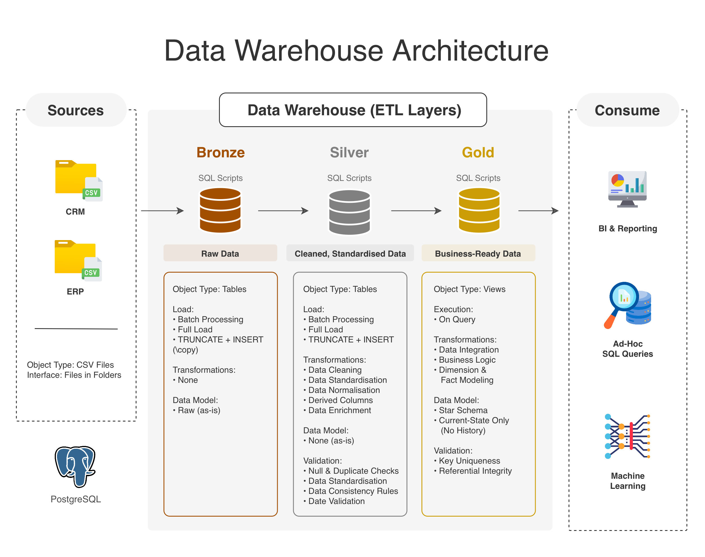

# SQL Data Warehouse Project

Welcome to this repository! 👋  

This project represents my first end-to-end **Data Warehouse** build, where I transform raw data into **clean, structured, and business-ready datasets** using SQL.

The goal is to simulate a real-world data engineering workflow — starting from raw CSV files and building a complete data pipeline using a medallion architecture (**Bronze → Silver → Gold**).

Throughout this project, I focus on applying practical data engineering concepts, including:
- data modeling  
- ETL pipeline design  
- data cleaning and standardisation  
- data quality validation  

Let's dive in!

---

## 📋 Project Overview

This project covers:

* **Data Architecture** → Designing a layered warehouse model  
* **ETL Pipelines** → Building SQL-based transformation pipelines  
* **Data Modeling** → Creating dimension and fact models  
* **Data Quality** → Implementing validation checks across layers  
* **Documentation** → Ensuring clarity and maintainability  

---

## 🛠️ Tools & Technologies

* **PostgreSQL** – Database used for data storage and transformations  
* **VS Code (SQLTools)** – Development environment for writing and executing SQL  
* **Draw.io** – Used to design architecture and data model diagrams  

---

## 📐 Data Architecture

The project follows the **Medallion Architecture** approach:



### 📑 Layer Overview

#### Bronze Layer

* **Analysis**: Understand source systems (CRM and ERP), including data structure and business context  
* **Data ingestion**: Load data from CSV files into PostgreSQL (full load)  
* **Validation**: Data completeness and schema checks  
* No transformations are applied  
* **Documentation**: Versioning using Git  

---

#### Silver Layer

* **Analysis**: Explore and understand the data  
* **Data cleaning and standardisation**: Prepare data for analytical use by fixing inconsistencies and improving data quality  
* **Validation**: Data quality, correctness, and consistency checks  
* **Documentation**: Versioning in Git, including data flow and integration logic  

---

#### Gold Layer

* **Analysis**: Understand business entities and relationships  
* **Data integration**: Combine data into a **star schema** using dimension and fact views  
* **Validation**: Ensure referential integrity and surrogate key uniqueness  
* **Documentation**: Data model, data catalog, and data flow  
* Only **current-state data** is used (no historical tracking)  

---

## 📂 Repository Structure

To support this architecture, the project is organised as follows:

```
sql-data-warehouse/
│
├── datasets/
│   ├── source_crm/
│   │   ├── cust_info.csv
│   │   ├── prd_info.csv
│   │   └── sales_details.csv
│   ├── source_erp/
│   │   ├── CUST_AZ12.csv
│   │   ├── LOC_A101.csv
│   │   └── PX_CAT_G1V2.csv
├── documents/                 # Documentation and diagrams
│   ├── data_warehouse_architecture.png
│   ├── data_flow.png
│   ├── data_integration.png
│   ├── data_model.png
│   ├── data_catalog.md
│   └── naming_conventions.md
│
├── scripts/
│   ├── bronze/                # Raw data loading scripts
│   │   ├── 02_ddl_bronze.sql
│   │   └── 03_load_bronze.sql
│   ├── silver/                # Transformation scripts
│   │   ├── 04_ddl_silver.sql
│   │   └── 05_load_silver.sql
│   ├── gold/                  # Analytical views
│   │   └── 07_ddl_gold.sql
│   └── 01_create_schemas.sql
│
├── tests/                     # Data quality checks
│   ├── 06_quality_checks_silver.sql
│   └── 08_quality_checks_gold.sql
│
├── README.md
└── LICENSE
```

---

## ⚙️ SQL Script Execution Order

SQL scripts are organised using a numeric prefix to ensure a clear execution sequence:

| Order | Script Purpose       |
|------|---------------------|
| 01   | Create schemas       |
| 02   | Create Bronze tables |
| 03   | Load Bronze data     |
| 04   | Create Silver tables |
| 05   | Load Silver data     |
| 06   | Validate Silver data |
| 07   | Create Gold views    |
| 08   | Validate Gold data   |

This structure ensures:

* Reproducibility  
* Clear execution order  
* Separation of concerns (SoC)  

---

## 📊 Documentation & Diagrams

This project emphasises **clear and structured documentation**, including:

* **Data Warehouse Architecture Diagram**  
  → Overall system design  

* **Data Flow Diagram**  
  → Movement of data across layers  

* **Data Integration Diagram**  
  → Relationships between datasets  

* **Data Model Diagram**  
  → Star schema (Gold layer)  

* **Data Catalog**  
  → Column-level definitions  

* **Naming Conventions**  
  → Consistent standards across the project  

All diagrams are created using Draw.io for simplicity and clarity.

---

## ☑️ Skills Demonstrated

This project showcases:

* SQL development (PostgreSQL)  
* Data modeling (star schema)  
* ETL pipeline design  
* Data validation and quality checks  
* Documentation and data governance  
* Analytical thinking  

---

## 🚀 Future Improvements

Potential enhancements include:

* Performing Exploratory Data Analysis (EDA)  
* Adding a dashboard layer (Power BI or Tableau)  
* Introducing workflow orchestration (e.g., Apache Airflow)  

---

## 🛡️ License

This project is licensed under the MIT License. See the [LICENSE](LICENSE) file for details.

---

## 🔗 More About Me

Check out more of my work on my [GitHub profile](https://github.com/angelcpizarro)  
or connect with me on [LinkedIn](https://linkedin.com/in/angelcpizarro).

---

Thank you for visiting! 😸
